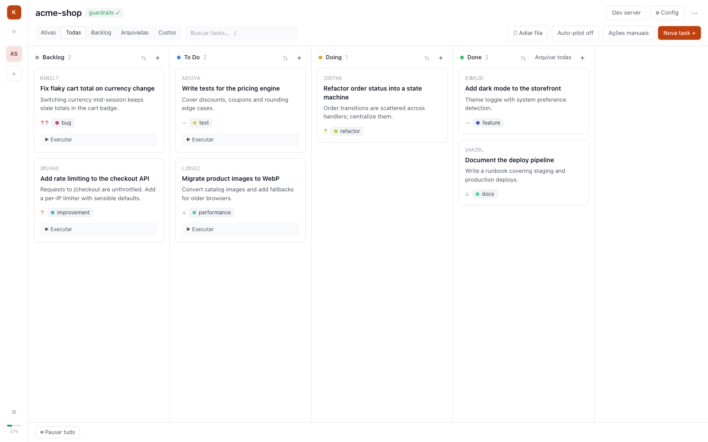

# claude-kanban

> [English version](README.md)

> **Aviso:** Este é um projeto não-oficial da comunidade, sem afiliação, endosso ou patrocínio da Anthropic. "Claude" é marca registrada da Anthropic, PBC.

Gerenciador de tasks local (React + Node) para o [Claude Code](https://claude.com/claude-code). O kanban é uma camada visual sobre arquivos `.md` em `.claude/claude-kanban/tasks/` de cada projeto; as tasks são executadas em sessões headless (`claude -p`), uma por vez, com log ao vivo no board.



Spec completa: [`docs/initial-scope.spec`](docs/initial-scope.spec). Rotas HTTP, eventos WebSocket e layout do estado: [`docs/api.md`](docs/api.md).

## Requisitos

- Node 20+
- CLI `claude` no PATH (para executar tasks)

## Rodando

```bash
npm install
npm run dev        # backend em :4400 + frontend em :5544 (proxy /api)
```

Abra http://localhost:5544 e cadastre um projeto (nome + diretório raiz) — isso dispara o **bootstrap**: estrutura de pastas, `guard.mjs`, skill `claude-kanban` e merge dos hooks em `.claude/settings.json` (idempotente, preserva conteúdo existente).

## Testes

```bash
npm test           # suíte do guard.mjs + core (tasks, bootstrap, pending)
```

## Como funciona

- **Fonte da verdade é o filesystem.** Status vive na pasta (`backlog/ todo/ doing/ done/ archived/`) e no frontmatter; em divergência, **a pasta vence** (reconciliação no boot e via watcher).
- **Sugestão de tasks por análise.** O botão "✨ Sugerir tasks" roda uma sessão headless somente leitura (`Read`/`Glob`/`Grep`) no projeto e sugere tasks dos tipos escolhidos (melhoria, correção, feature, refatoração, teste, documentação). Você seleciona quais viram cards no Backlog — criadas com a tag `sugerida` + o tipo, para filtrar.
- **Fila global de execução**, concorrência 1. Cada task roda em sessão nova e isolada, `--permission-mode acceptEdits` por padrão, ou `--dangerously-skip-permissions` se o toggle por projeto estiver ligado.
- **Guardrails determinísticos** (hooks `PreToolUse` com `deny`, valem mesmo sob skip-permissions):
  - não ler/escrever `.env` (exceto `.example`/`.template`);
  - não commitar/pushar/mergear em `main`/`master`;
  - não deletar branches;
  - não deletar arquivos fora do projeto — ações bloqueadas viram itens em "Ações manuais" (`pending-actions.md`) para o humano.

### Limite honesto dos guardrails

O `guard.mjs` funciona por parsing/regex do comando — **não é sandbox**. Comandos ofuscados (variáveis, base64, scripts intermediários) podem escapar. Os guardrails cobrem o caso realista de o modelo tentar a ação diretamente; para isolamento forte, rode o projeto em container/worktree.

## Estrutura

```
server/   Fastify + watcher (chokidar) + runner (spawn claude -p) + templates (guard.mjs, SKILL.md)
web/      React + Vite + Tailwind + dnd-kit
docs/     spec inicial + docs/api.md (rotas HTTP, eventos WS)
```

Estado do app em `~/.claude-kanban/`. Sem banco de dados — tudo é arquivo:

```
projects.json                  projetos cadastrados (path, git, dev server, flags)
state.json                     fila de execução + concorrência (sobrevive a restarts)
ledger.json                    tasks que já rodaram com exit 0
lock                           pid da instância viva (impede duas instâncias)
worktrees/<projectId>/<taskId> worktree git isolado de cada run
```

O **ledger** existe porque o status da task vive na *pasta* do arquivo `.md`, e essas pastas são excluídas dos commits da sessão. Sem ele, uma task concluída cujo `done/` se perdesse (worktree descartado, troca de branch) reapareceria em `todo/` e, com auto-run ligado, re-executaria em loop. Regra: só sucesso entra no ledger; caminhos automáticos nunca re-executam algo registrado (apenas reconciliam o status para `done`); um run pedido explicitamente pelo humano limpa o registro e roda de novo.

O que é do projeto — e não do app — vive em `<projeto>/.claude/claude-kanban/`: `tasks/<status>/*.md`, `diffs/`, `pending-actions.md`, a skill e o `guard.mjs`.

### Variáveis de ambiente

| Variável | Default | Efeito |
| --- | --- | --- |
| `PORT` | `4400` | Porta do backend (host fixo em `127.0.0.1`). |
| `CLAUDE_KANBAN_HOME` | `~/.claude-kanban` | Raiz do estado acima. Aponte para outro diretório para rodar uma instância isolada. |
| `CLAUDE_KANBAN_ALLOWED_ORIGINS` | — | `Origin`s extras permitidos (separados por vírgula) além de `http://localhost:5544` / `http://127.0.0.1:5544`. Requisições de outros origins ou hosts fora de localhost recebem 403. |

## Licença

[MIT](LICENSE)
